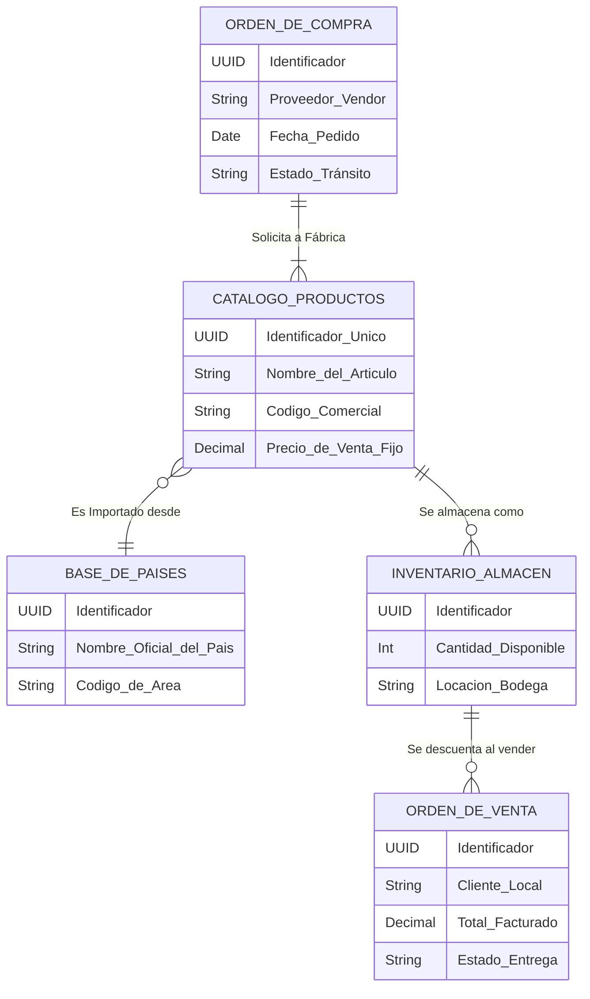
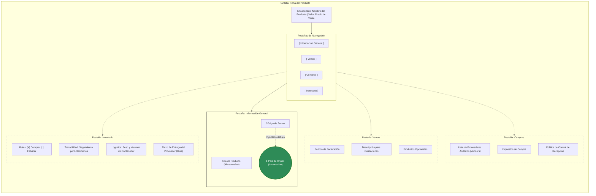
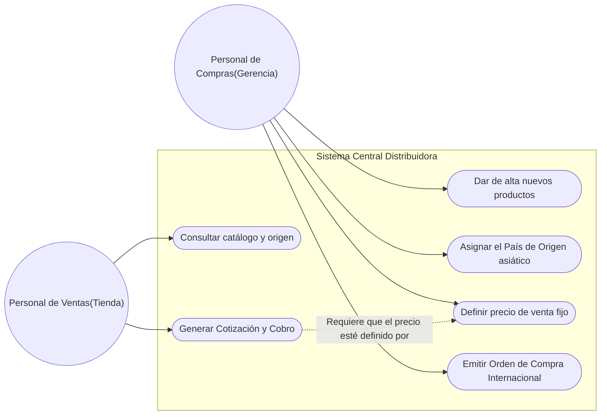
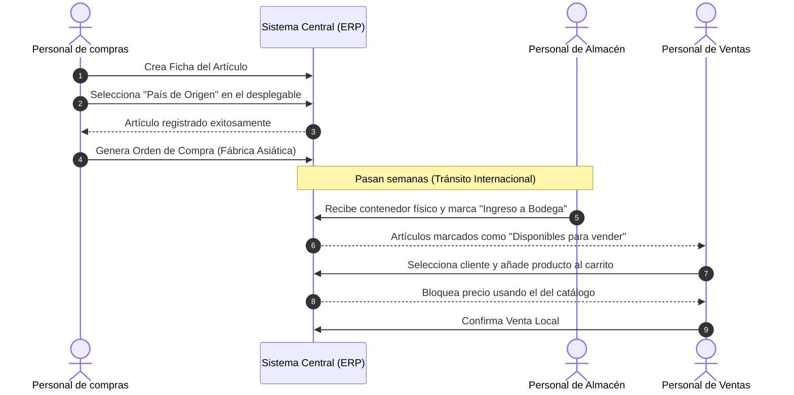

| DNI:  | 00000000 |
| :---- | :------- |
| NAME: | Fairw    |

**ASIAN DISTRIBUTOR APP**

| FILE NUMBER | :    | AD-UML-01                        |
| :---------- | :--- | :------------------------------- |
| FILE TITLE  | :    | UML - Asian Distributor App      |
| START DATE  | :    | 26/02/2026                       |
| PROJECT     | :    | Distribuidora Asiática (Odoo 18) |
| PROGRAMMER  | :    | Fairw                            |

---

# 1. Diagramas Estructurales del Negocio

## 1.1. Modelo Entidad-Relación
Este diagrama ilustra gráficamente cómo se interconecta la información principal del negocio. Muestra que cada producto importado debe estar obligatoriamente enlazado a un país existente en la lista global, garantizando que no existan errores tipográficos al registrar el origen.

## 1.2. Estructura de la Interfaz Visual
Este diagrama muestra cómo se organiza visualmente la pantalla principal de un producto para los usuarios. Asegura que el dato más importante para aduanas (País de Origen) esté visible en la primera plana, sin que el usuario deba buscar en otras pestañas.

---

# 2. Diagramas de Comportamiento (Flujos)

## 2.1. Casos de Uso del Sistema
Este diagrama define de manera sencilla qué acciones puede realizar cada actor humano dentro del sistema ERP. Refleja claramente el bloqueo comercial para los vendedores.

## 2.2. Flujo Operativo Core (Diagrama de Secuencia)
Este diagrama de secuencia traza el recorrido lógico y de tiempo desde que se piensa en importar un producto hasta que se le factura al cliente final, respetando las reglas de validación de almacén y precios fijos.

